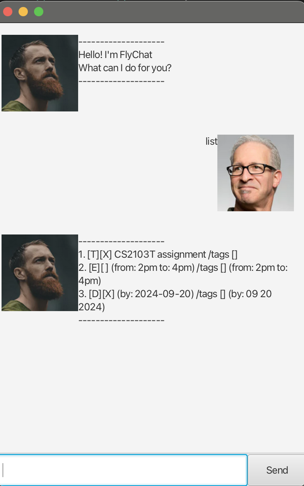

# FlyChat User Guide



> **_Losing your mind_ trying to remember all the tasks you have to do?**  
> Use _FlyChat_, and let your mind fly **free**

## Adding tasks

There are _3_ types of tasks you can add in _FlyChat_: **Todo**, **Event**, **Deadline**  
All fields, marked in <>, **must not** be empty.

### Todo

Format: todo <description>

eg. `todo Wash Dishes`

Expected Output:

```
Task added:
[T][] Wash Dishes /tags []
Now you have *n tasks in the list. HAVE FUN ^o^
```

### Event

Format: event <description> /from <startTime> /to <endTime>

eg. `event Piano Lesson /from 2pm /to 4pm`

Expected Output:

```
Event added:
[E][] Piano Lesson /tags [] (from: 2pm to: 4pm)
Now you have *n tasks in the list. HAVE FUN ^o^
```

### Deadline

Format: deadline <description> /by <Date (yyyy-mm-dd)>

eg. `deadline CS2103T Assignment /by 2024-12-15`

Expected Output:

```
Deadline added:
[D][] CS2103T Assignment /tags [] 
Now you have *n tasks in the list. HAVE FUN ^o^
```

## Tags

Tags allow users to group related tasks under the same tag, improving organization.

Note: Tags **MUST** start with a "#".

### Adding Tags

Format: tag <taskNumber> <tag>

Description: Assigns `tag` to the specified task as a tag.

## Other commands

### List

Format: list

Description: Lists out all tasks in your task list.

### Mark / Undo Mark Task

Format: mark <taskNumber> / unmark <taskNumber>

Description: Marks the specified task as completed or undo the mark.

### Delete

Format: delete <taskNumber>

Description: Deletes the specified task.

### Find

Format: find <keyPhrase>

Description: Lists out all tasks containing the `keyPhrase`.

### Bye

Format: bye

Description: Quits the application.